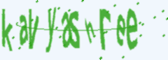

*****BASIC PYTHON PROJECTS*****

******1.ATM-SIMULATOR******

The main aim of this project is to demonstrate how an Automated Teller Machine (ATM) works and functions as like ATM machine.
The operations performed are:

1.BALENCE ENQUIRY:
               It provides the balance amount associated to their bank account. The user is requested to enter their ATM PIN which is a 4 - digit number and the balance amount is executed.  

2.PIN UPDATON:
              The user is requested to enter their current ATM PIN and asked to enter the new pin they want to setup and hence the pin gets updated.

3.CASH WITHDRAWL:
              The user is asked to enter ATM PIN and the amount to withdraw. After the withdrawl the balance amount in the account is shown.

4.CASH DEPOSIT:
              The user is asked to enter pin and the amount to deposit to account and then the current balance is shown.

5.MONEY TRANSFER:
              The user is requested to enter their PIN numbers and the account number to which they want to transfer money and then  asked to enter the amount to transfer. At last the balance amount is shown for both the accounts.

I have used python dictionary data structure to store the users infomation.

*****2.ROCK PAPER SCISSOR GAME*****

It is a text based rock paper scissor game where the user can enter either rock or paper or scissor. The computer plays along with the user choosing random options. The probability of choosing the 3 options is equally likely. The game consists of 5 rounds who scores the more wins the game.

*****3.MASTER TYPING*****

NOTE: TO EXECUTE THIS CODE YOU MUST DOWNLOAD words.csv FILE.

Master typing can be considered as a platform for practicing the accuracy of typing on keyboard. I have created a total score of 50 points where the user can practice 10 words every execution. The points are displayed at the end of the trial along with the time taken to complete the trial. There is an option of exiting from the execution.
It allows the user to crosscheck the time taken to complete and hence realize improvement. I have used a csv file which contains 10,000 English words. 

For this project I have imported 5 modules. All the modules are provided by python. 

1.	Random module: For choosing random words from the given csv file.

2.	System specific module: For exiting in between the execution.

3.	Numpy: For creating array of lists of words from the csv file.

4.	Csv module: For reading the dowmloaded csv file.

5.	Time module: For implementing time gap for better user experiance. 

*****4.TEXT BASED ROLLING DICE*****

This project is a text based rolling dice simulator where the user can choose either rolling a single die or multiple dice. I have provided with an option of anytime exit from the terminal. It is a beginner level python mini project.

*****5.GUESS THE NUMBER GAME*****

The game is made with Python language,where I have used basics of python as a key measure to complete this mini project.
The game provides you with 5 chances of guessing the number and intresting hints will be displayed as soon as the game starts.
I have also included error handling scripts.The modules used are Random module,Time module,System Specific module.

*****6.EMAIL SLICER*****

The email slicer is a quite handy program to get the username and domain name from an email address. You can play around and even customize it further and send a message to the user with this information. 

An email can be divided into three parts 

1.USERNAME

2.MAIL SERVER NAME

3.TOP LEVEL DOMAIN NAME

For suppose the email is kavyashree3513@gmail.com then kavyashree3513 will become the username, gmail will be the mail server name and .com is the top level domain name.

*****7.CREATING AUDIO AND IMAGE CAPTCHA*****

Captcha is a challenge provided to the users to detect whether the user is a human or spam robot. 

This code can be implemented with jupyter notebook

Start by installing captcha module

pip install captcha

Now you are good to go..

*****8.MADLIBS GENERATOR*****

This is super easy and fun to make. The whole concept is string concatenation. You can create you own madlibs and have fun.

### LICENSE

LICENSED UNDER [MIT LICENSE](LICENSE)

